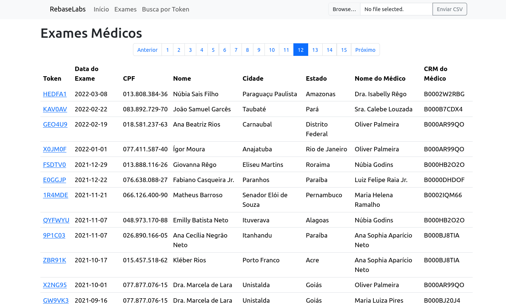
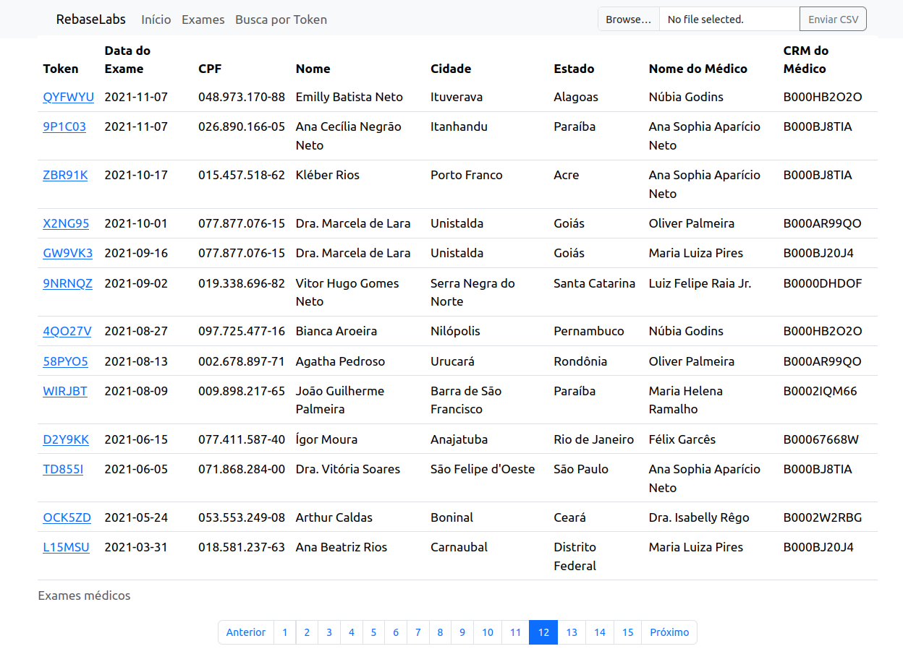
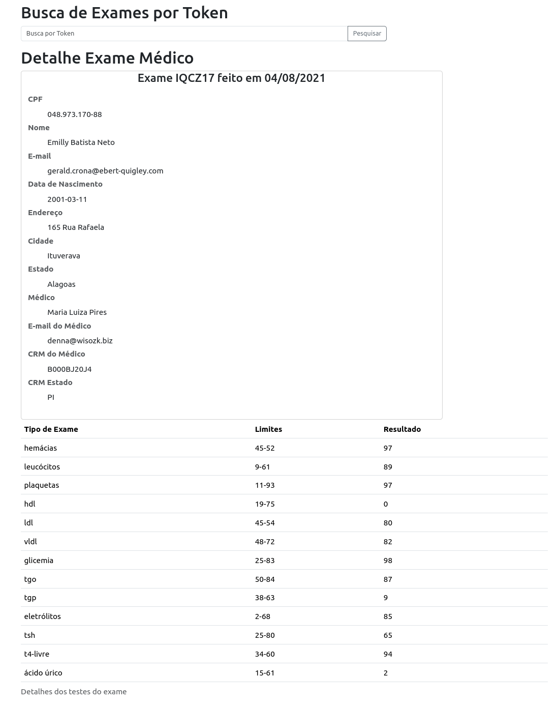

# Medical Exams App

This is a Ruby application that provides access to medical exams data. It uses Sinatra as the web framework and PostgreSQL as the database. It also uses Sidekik and Redis to run asynchronous jobs, all installed inside docker containers. The frontend is a Single Page Application built with Vanilla JavaScript.

The exams are paginated and can be filtered by token. The application also allows importing exams data from a csv file.

## Table of Contents

- [Technologies](#technologies)
- [Page Screenshots](#page-screenshots)
- [Prerequisites](#prerequisites)
- [Running the Application](#running-the-application)
- [Accessing the Frontend App](#accessing-the-frontend-app)
- [View containers information](#view-containers-information)
- [Accessing the Containers](#accessing-the-containers)
- [Accessing the Database](#accessing-the-database)
- [View container logs](#view-container-logs)
- [Running the Tests](#running-the-tests)
- [API](#api)
  - [All exams](#all-exams)
    - [GET /tests](#get-tests)
    - [GET /tests?page=2&limit=2](#get-testspage2limit2)
  - [Filtering by Token](#filtering-by-token)
    - [GET /tests/:token](#get-teststoken)
  - [Importing csv file](#importing-csv-file)
    - [POST /tests/import](#post-testsimport)
  - [Server Errors](#server-errors)

## Technologies

## Technologies

           

## Page Screenshots

#### Top Pagination


#### Bottom Pagination


#### Exams Details


## Prerequisites

Before you begin, ensure you have met the following requirements:

- You have installed the latest version of [Docker](https://docs.docker.com/engine/install/) and [Docker Compose](https://docs.docker.com/compose/install/).

## Running the Application

Be sure to not having a postgresql service running on your machine in port 5432. You can check it by typing the following command:
```sh
sudo lsof -i :5432
```

If yes, it will show you the process id of the service.
```sh
COMMAND    PID     USER   FD   TYPE DEVICE SIZE/OFF NODE NAME
postgres 14087 postgres    3u  IPv4 126791      0t0  TCP localhost:postgresql (LISTEN)
```

Type the following command to stop it:
```sh
sudo systemctl stop postgresql
```

To run the Application, follow these steps:

1. Clone this repository.
2. Navigate to the project directory.
3. Run the following commands:

Change the permissions of bin/dev to make it executable
```sh
chmod +x bin/dev
```

To build, (re)create, start and attach to the application with Docker Compose (Recommended), because it's easier to see the logs and the containers are created in the correct order to function properly, run the following command:
```sh
bin/dev up
```

To stop containers and remove containers, networks, volumes, and images created by up:
```sh
bin/dev down
```

To start existing containers for a service:
```sh
bin/dev start
```

To stop existing containers for a service without removing them. hey can be started again with `bin/dev start`:
```sh
bin/dev stop
```

To rebuild the application with Docker Compose:
```sh
bin/dev rebuild
```

The command `bin/dev start` will start three (5) Docker containers: one for the PostgreSQL database, one for the Ruby/Sinastra API, one for the frontend Ruby/Sinastra App, one for the Redis DB and the last for Sidekik. The API will be available at `http://localhost:3001/tests` in your local machine. Inside the containers, the API will be available at `http://backend:3001/tests`.

Firstly, the database will be created and be connected. 
This message will be on the console for a while if you are using the `bin/dev start` command:

```sh
db-1   | 2024-03-04 17:02:25.373 UTC [36] LOG:  database system is ready to accept connections
```

After this, the database will be seeded with some data.

Then, the API will be started. In the console, you will see the API logs. You will be granted access to the API once you see this message. It could take a while to see it:

```sh
Puma starting in single mode...
app-1  | * Puma version: 6.4.2 (ruby 3.2.3-p157) ("The Eagle of Durango")
app-1  | *  Min threads: 0
app-1  | *  Max threads: 5
app-1  | *  Environment: development
app-1  | *          PID: 8
app-1  | * Listening on http://0.0.0.0:3001
app-1  | Use Ctrl-C to stop
```

## Accessing the Frontend App

To access the frontend app, open your browser and navigate to `http://localhost:3000/` after this log appears in the console:

```sh
medical_exams_frontend  | wait-for-it.sh: backend:3001 is available after 2 seconds
medical_exams_frontend  | Puma starting in single mode...
medical_exams_frontend  | * Puma version: 6.4.2 (ruby 3.2.3-p157) ("The Eagle of Durango")
medical_exams_frontend  | *  Min threads: 0
medical_exams_frontend  | *  Max threads: 5
medical_exams_frontend  | *  Environment: development
medical_exams_frontend  | *          PID: 1
medical_exams_frontend  | * Listening on http://0.0.0.0:3000
medical_exams_frontend  | Use Ctrl-C to stop
```

## View containers information

To view the containers information, run:

```sh
docker ps
```

## Accessing the Containers

To access the API backend container, run:

```sh
docker exec -it medical_exams_backend bash
```

To access the App frontend container, run:

```sh
docker exec -it medical_exams_frontend bash
```

## Accessing the Database

To access the PostgreSQL database, run:

```sh
docker exec -it medical_exams_db psql -U postgres -d medical_exams
```

## View container logs

To view the logs of the containers, run:

```sh
docker logs <container_name>
```

if you started the containers with `bin/dev start`, you can use the following command to view the logs of the containers:

```sh
bin/dev logs
```

## Running the Tests

To run the tests, you need to access the specific containers as described above. Then, run:

```sh
cd src && bundle exec rspec
```

# API

## All exams

### GET /tests

You can make GET requests to the `/tests` endpoint to retrieve medical exams data. Here's an example using curl:

```sh
curl http://localhost:3001/tests
```

This will return a JSON hash with the medical exams data and **STATUS CODE = 200**

```json
{
  "previous": null,
  "next": null,
  "results": [
    {
      "token": "5UP5FA",
      "exam_date": "2022-03-27",
      "cpf": "081.878.172-67",
      "name": "Emanuel Beltrão Neto",
      "email": "jennine@mosciski-swaniawski.co",
      "birthday": "1989-10-28",
      "address": "5538 Avenida Lívia",
      "city": "Pão de Açúcar",
      "state": "Roraima",
      "doctor": {
        "crm": "B000B7CDX4",
        "crm_state": "SP",
        "name": "Sra. Calebe Louzada",
        "email": "kendra@nolan-sawayn.co"
      },
      "tests": [
        {
          "type": "hdl",
          "limits": "19-75",
          "result": "59"
        },
        {
          "type": "plaquetas",
          "limits": "11-93",
          "result": "10"
        },
        {
          "type": "leucócitos",
          "limits": "9-61",
          "result": "84"
        },
        {
          "type": "hemácias",
          "limits": "45-52",
          "result": "21"
        },
        {
          "type": "ácido úrico",
          "limits": "15-61",
          "result": "25"
        },
        {
          "type": "t4-livre",
          "limits": "34-60",
          "result": "61"
        },
        {
          "type": "tsh",
          "limits": "25-80",
          "result": "48"
        },
        {
          "type": "eletrólitos",
          "limits": "2-68",
          "result": "61"
        },
        {
          "type": "tgp",
          "limits": "38-63",
          "result": "27"
        },
        {
          "type": "tgo",
          "limits": "50-84",
          "result": "86"
        },
        {
          "type": "glicemia",
          "limits": "25-83",
          "result": "99"
        },
        {
          "type": "vldl",
          "limits": "48-72",
          "result": "7"
        },
        {
          "type": "ldl",
          "limits": "45-54",
          "result": "24"
        }
      ]
    },
    {
      "token": "85OIFQ",
      "exam_date": "2022-03-27",
      "cpf": "071.868.284-00",
      "name": "Dra. Vitória Soares",
      "email": "michale.huel@lynch.io",
      "birthday": "1963-09-29",
      "address": "27106 Ponte Francisca Munhoz",
      "city": "São Felipe d'Oeste",
      "state": "São Paulo",
      "doctor": {
        "crm": "B0002W2RBG",
        "crm_state": "CE",
        "name": "Dra. Isabelly Rêgo",
        "email": "diann_klein@schinner.org"
      },
      "tests": [
        {
          "type": "tsh",
          "limits": "25-80",
          "result": "52"
        },
        {
          "type": "eletrólitos",
          "limits": "2-68",
          "result": "89"
        },
        // more tests data
      ]
    },
    // More exams data
  ]
}
```

#### GET /tests?page=2&limit=2

The exams can also be paginated. The response will contain a `previous` and `next` keys alongside the exams results. If there are no more pages, the value will be `null`.

```sh
curl http://localhost:3001/tests?page=2&limit=2
```

```json
{
  "previous": {
    "page": 1,
    "limit": 2
  },
  "next": {
    "page": 3,
    "limit": 2
  },
  "results": [
    {
      "token": "T9O6AI",
      "exam_date": "2021-11-21",
      "cpf": "066.126.400-90",
      "name": "Matheus Barroso",
      "email": "maricela@streich.com",
      "birthday": "1972-03-09",
      "address": "9378 Rua Stella Braga",
      "city": "Senador Elói de Souza",
      "state": "Pernambuco",
      "doctor": {
        "crm": "B000B7CDX4",
        "crm_state": "SP",
        "name": "Sra. Calebe Louzada",
        "email": "kendra@nolan-sawayn.co"
      },
      "tests": [
        {
          "type": "hemácias",
          "limits": "45-52",
          "result": "48"
        },
        {
          "type": "leucócitos",
          "limits": "9-61",
          "result": "75"
        },
        {
          "type": "plaquetas",
          "limits": "11-93",
          "result": "67"
        },
        {
          "type": "hdl",
          "limits": "19-75",
          "result": "3"
        },
        {
          "type": "ldl",
          "limits": "45-54",
          "result": "27"
        },
        {
          "type": "vldl",
          "limits": "48-72",
          "result": "27"
        },
        {
          "type": "glicemia",
          "limits": "25-83",
          "result": "78"
        },
        {
          "type": "tgo",
          "limits": "50-84",
          "result": "15"
        },
        {
          "type": "tgp",
          "limits": "38-63",
          "result": "34"
        },
        {
          "type": "eletrólitos",
          "limits": "2-68",
          "result": "92"
        },
        {
          "type": "tsh",
          "limits": "25-80",
          "result": "21"
        },
        {
          "type": "t4-livre",
          "limits": "34-60",
          "result": "95"
        },
        {
          "type": "ácido úrico",
          "limits": "15-61",
          "result": "10"
        }
      ]
    },
    {
      "token": "TJUXC2",
      "exam_date": "2021-10-05",
      "cpf": "089.034.562-70",
      "name": "Patricia Gentil",
      "email": "herta_wehner@krajcik.name",
      "birthday": "1998-02-25",
      "address": "5334 Rodovia Thiago Bittencourt",
      "city": "Jequitibá",
      "state": "Paraná",
      "doctor": {
        "crm": "B0002W2RBG",
        "crm_state": "CE",
        "name": "Dra. Isabelly Rêgo",
        "email": "diann_klein@schinner.org"
      },
      "tests": [
        {
          "type": "hemácias",
          "limits": "45-52",
          "result": "75"
        },
        {
          "type": "leucócitos",
          "limits": "9-61",
          "result": "24"
        },
        {
          "type": "plaquetas",
          "limits": "11-93",
          "result": "26"
        },
        {
          "type": "hdl",
          "limits": "19-75",
          "result": "87"
        },
        {
          "type": "ldl",
          "limits": "45-54",
          "result": "21"
        },
        {
          "type": "vldl",
          "limits": "48-72",
          "result": "76"
        },
        {
          "type": "glicemia",
          "limits": "25-83",
          "result": "86"
        },
        {
          "type": "tgo",
          "limits": "50-84",
          "result": "2"
        },
        {
          "type": "tgp",
          "limits": "38-63",
          "result": "84"
        },
        {
          "type": "eletrólitos",
          "limits": "2-68",
          "result": "90"
        },
        {
          "type": "tsh",
          "limits": "25-80",
          "result": "94"
        },
        {
          "type": "t4-livre",
          "limits": "34-60",
          "result": "35"
        },
        {
          "type": "ácido úrico",
          "limits": "15-61",
          "result": "94"
        }
      ]
    }
  ]
}
```


And returns an empty array if there is no data in the database and **STATUS CODE = 404**

```json
[]
```

## Filtering by Token

### GET /tests/:token

This endpoint also accepts a `token` named parameter to filter the exams by token. Here's an example:

```sh
curl http://localhost:3001/tests/IQCZ17
```

This will return a JSON object with the medical exam data for the token `IQCZ17`.

```json
[
  {
    "token"=>"IQCZ17",
    "exam_date"=>"2021-08-05",
    "cpf"=>"048.973.170-88",
    "name"=>"Emilly Batista Neto",
    "email"=>"gerald.crona@ebert-quigley.com",
    "birthday"=>"2001-03-11",
    "address"=>"165 Rua Rafaela",
    "city"=>"Ituverava",
    "state"=>"Alagoas",
    "doctor"=>{
      "crm"=>"B000BJ20J4",
      "crm_state"=>"PI",
      "name"=>"Maria Luiza Pires",
      "email"=>"denna@wisozk.biz"
    },
    "tests"=>[
      {
        "type"=>"hemácias",
        "limits"=>"45-52",
        "result"=>"97"
      },
      {
        "type"=>"leucócitos",
        "limits"=>"9-61",
        "result"=>"89"
      },
      // rest of the tests
    ]
  }
]
```

And returns an empty array if there is no data in the database and **STATUS CODE = 404**

```json
[]
```

## Importing csv file

### POST /tests/import

You can make POST requests to the `/tests/import` endpoint to import medical exams data from a csv file. Here's an example using curl:

```sh
curl -X POST -F "file=@/path/to/your/file.csv" http://localhost:3001/tests/import
```

This will return a JSON object with the message `File imported successfully` and **STATUS CODE = 200**

```json
{ success: true, message: 'Data imported successfully' }
```

And returns an error message if the file is not a csv file and **STATUS CODE = 400**

```json
{ success: false, message: 'Invalid file type. Please, upload a csv file' }
```

## Server Errors

If the server encounters an error, it will return a JSON object with the error message and **STATUS CODE = 500**

```json
{ error: true,  message: 'An error has occurred. Try again' }
```